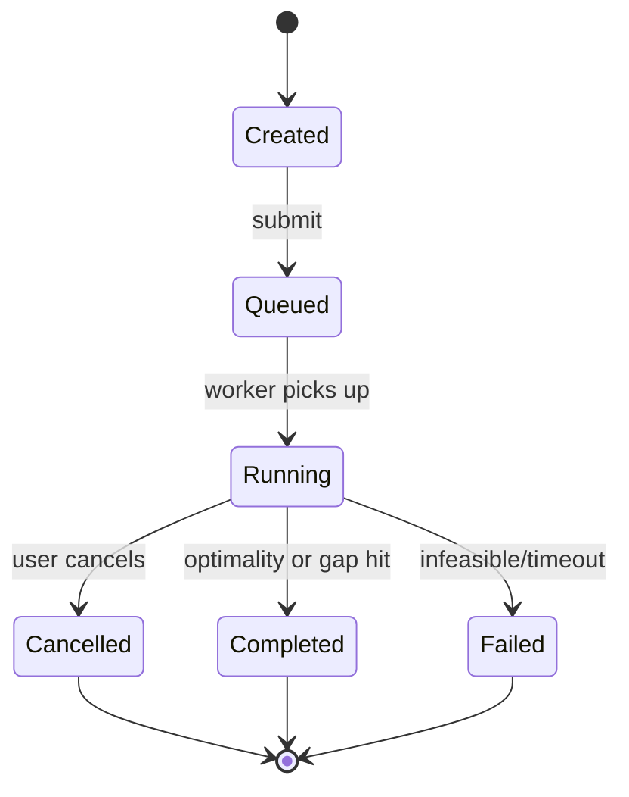
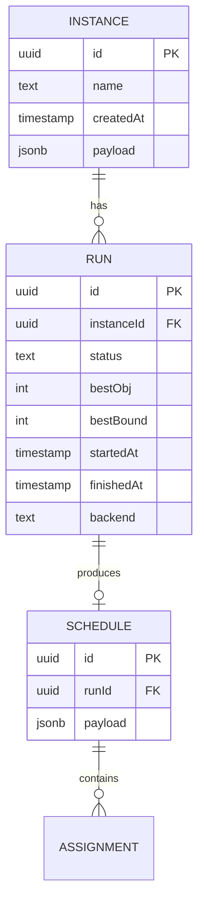

# Chapter 14 — Spec-Driven Design: Write & LOCK the NSP App Spec

> **Phase 6: Spec-driven app design** · Estimated: ~4h · Status: ready-to-start · Last updated: 2026-04-19

## Goal

Produce a **complete, locked markdown specification** for the end-to-end NSP application before any application code is written. You'll author ten spec files under `specs/nsp-app/`, walk each through with Claude, and only when Vanja explicitly says "locked v1.0" does Phase 7 implementation start.

This is the only chapter with **no solver work**. It's a practice of the discipline every serious software project needs and few learners actually do: write the contract first.

## Before you start

- **Prerequisites:** Chapters 11–13 (you need to know what the solver can do before specifying a UI on top of it).
- **Required reading:**
  - [`docs/plan.md`](../plan.md) §4 (Chapter 14 scope), §6 (target repo layout).
  - [`docs/knowledge/nurse-scheduling/overview.md`](../knowledge/nurse-scheduling/overview.md) §7 (variants), §12 (real-world complications) — so you know what to *cut* from v1.0 scope.
- **Environment:** plain markdown editor. You will produce *no code this chapter*.

## Concepts introduced this chapter

- **Spec-driven development** — write the contract, review, lock, then build. Inverts the "agile = no docs" folk wisdom.
- **Vision document** — a 1-page statement of what this app is for, who uses it, and what it will *not* be.
- **User story (Given/When/Then)** — a behavior specified from the user's point of view, testable without looking at code.
- **Domain model** — entities + relationships; the vocabulary the rest of the spec (and the code) uses.
- **Functional requirement (FR)** — a behavior the system must exhibit. Numbered: FR-1, FR-2, ...
- **Non-functional requirement (NFR)** — performance, security, accessibility, observability. Often the hardest to get right, most often under-specified.
- **API contract** — OpenAPI 3.1 document; the single source of truth for request/response shapes.
- **Acceptance criterion (AC)** — a concrete, testable condition that proves an FR is satisfied.
- **Wireframe** — low-fidelity sketch of a UI screen. ASCII or pencil is fine for v1.

## 1. Intuition

A spec is like a court filing for your app: what you're building, for whom, under what rules, and how you know you've won. The point isn't to write a novel — it's to *pin down decisions* that are cheap now and expensive later.

A common failure mode: you start coding, then realize you never agreed what "feasible schedule" means when there's a no-available-nurse edge case, or whether the UI streams intermediate solutions or only shows the final, or how a nurse edits a cell manually. Each of those ambiguities costs a day of rework later. A locked spec absorbs that cost up front.

A second failure mode: "the spec is the code." If you can only find the contract by reading the implementation, you can't change the implementation safely. Specs age slower than code; they point at what's stable.

## 2. Formal definition

### 2.1 The ten files of `specs/nsp-app/`

```
specs/nsp-app/
├── README.md                         # spec index + version history
├── 00-overview.md                    # 1-paragraph "what we're building"
├── 01-vision-and-goals.md            # north star + non-goals
├── 02-user-stories.md                # Given/When/Then primary flows
├── 03-domain-model.md                # Nurse, Shift, Instance, Schedule, …
├── 04-functional-requirements.md     # FR-1 .. FR-N
├── 05-non-functional-requirements.md # perf, a11y, security, obs
├── 06-api-contract.md                # pointer + OpenAPI 3.1 in apps/shared/openapi.yaml
├── 07-ui-ux.md                       # wireframes + user flows
├── 08-data-model.md                  # JSON schemas, DB ERD, file format
└── 09-acceptance-criteria.md         # how we know "done"
```

Every file under 1,000 lines. `04-` and `09-` cross-reference each other (every FR has ≥1 AC).

### 2.2 Shape of each file

| File | Sections to include | Out of scope |
|---|---|---|
| 00-overview | Problem statement, target user, one-liner ("what would I tell a stranger at a conference") | Design, endpoints, code |
| 01-vision-and-goals | North star (what success looks like in 12 months), goals (3–5), non-goals (3–5), in-scope vs out-of-scope for v1.0 | Tactics, tech choices |
| 02-user-stories | 8–12 user stories in G/W/T, one per primary flow | Edge cases (put in 04) |
| 03-domain-model | Entity list, attributes, relationships, invariants, state machines | Database schema (goes to 08) |
| 04-functional-requirements | FR-1 .. FR-N; each with ≤3 sentences + a link to AC | Implementation |
| 05-non-functional-requirements | Perf (solve ≤30s for toy, ≤5min for INRC-II mid-size), a11y (WCAG 2.1 AA), security, logging, observability, i18n/l10n (deferred) | Feature work |
| 06-api-contract | Endpoint list + pointer to `apps/shared/openapi.yaml` (full OpenAPI 3.1) | Internal services |
| 07-ui-ux | Wireframes (ASCII/hand-drawn), user flows, color/typography, state transitions | Pixel-perfect design |
| 08-data-model | JSON schemas for Instance + Schedule + RunRecord, DB ERD, file formats | ORM code |
| 09-acceptance-criteria | AC-1 .. AC-M; each maps to one or more FRs, testable in CI | Unit tests |

### 2.3 Versioning the spec

- `specs/nsp-app/README.md` has a `## Version history` table. v1.0 = locked at end of Chapter 14. Breaking changes bump major.
- Git tag the lock: `spec-nsp-app-v1.0`.
- Every spec file carries a front-matter line: `> _Version: 1.0 · Last updated: 2026-MM-DD_`.

## 3. Worked example by hand

Rather than worked code, here's a **walked-through spec file** — a template you can crib from.

### 00-overview.md (example)

```markdown
# NSP App — Overview

> _Version: 1.0 · Last updated: 2026-MM-DD_

## What this is

A web application for a nurse manager to build, validate, and adjust shift
rosters for a hospital ward. It wraps an OR-Tools CP-SAT solver behind a
spec-compliant JSON API and a grid-based UI.

## Who it's for

Single-ward nurse managers responsible for 10–60 nurses over 4-week horizons.
Not for multi-site hospital networks (v2+).

## One-liner

"Upload your ward's rules and preferences; get a legal, fair, explained
schedule in under a minute, then tweak cells manually and re-validate."
```

### 02-user-stories.md (snippet)

```markdown
## US-1 — Upload an instance

**As a** nurse manager
**I want to** upload a ward definition file
**So that** I can ask for a schedule

### Given
- I have a valid `instance.json` per the schema in 08-data-model.md §2

### When
- I POST the file to `/instances`

### Then
- The API returns `201 Created` with an `instance_id`
- The UI shows a summary: N nurses, D days, total demand
- Validation errors (schema mismatch) return `400` with human-readable messages
```

### 04-functional-requirements.md (snippet)

```markdown
## FR-3 — Solve on demand

**The system shall** provide a synchronous-feeling endpoint to solve a posted
instance, streaming intermediate incumbent solutions and the best dual bound
until a user-provided time limit is reached or the solver proves optimality.

Mapped to: US-2 (Solve), US-5 (Cancel).

Acceptance: AC-3, AC-5, AC-14.
```

### 09-acceptance-criteria.md (snippet)

```markdown
## AC-3 — Solve returns a feasible schedule within 30s for the toy instance

**Given** `data/nsp/toy-01.json` as the posted instance
**When** I POST to `/solve` with `{ timeLimit: 30 }`
**Then** the server MUST respond with a schedule satisfying all hard constraints within 30s wall time, as verified by `tools/validate-schedule`

Mapped to: FR-3.

Test: `tests/e2e/solve_toy.spec.ts`.
```

## 4. Writing the spec — step by step

There is no §4 Python and §5 Kotlin in this chapter. The work *is* the markdown. Here's the playbook.

### Step 1 — Draft 00 and 01 together

Open `specs/nsp-app/00-overview.md` and `01-vision-and-goals.md`. Fill them with 2–5 sentences each. Resist the urge to list features. Answer these questions:

- Who uses this in 5 years? (single-ward nurse managers)
- What do they do with it? (make rosters they can sign off on)
- What's out of scope for v1.0? (multi-site, mobile-first, patient-assignment)

Iterate with Claude until the one-liner reads like marketing copy without sounding marketed.

### Step 2 — User stories (02)

Write 8–12 Given/When/Then stories. Go *wide*, not deep. Cover:

- Upload an instance
- View an instance summary
- Solve (with streaming)
- View the resulting schedule (grid + KPIs)
- Manually edit a cell
- Re-validate after edit
- Re-solve with constraints locking the manually-edited cells
- Export the schedule (PDF / CSV)
- Cancel a running solve
- Save a named scenario

Each story ≤ 15 lines. Don't implement; describe.

### Step 3 — Domain model (03)

List entities. For each: attributes, relationships, invariants. Example:

```markdown
## Entity: Instance

- `id: UUID`
- `createdAt: timestamp`
- `name: string`
- `horizonStart: date`
- `horizonDays: int (>=1, <=365)`
- `nurses: Nurse[]`
- `shifts: ShiftDefinition[]`
- `skills: string[]`
- `demand: Demand3D`
- `forbiddenTransitions: [shift, shift][]`

### Invariants
- I-1: For every nurse `n`, `n.skills ⊆ skills`.
- I-2: For every `demand[d][s][k]`, `k ∈ skills` and `s` matches a shift id.
- I-3: `horizonDays ≥ 7` (at least one week) for v1.0.

### Relationships
- 1 Instance → many ScheduleRun (one-to-many)
- 1 Instance → 0..1 LockedSchedule (the committed output)
```

Draw state machines for entities with lifecycle (e.g., a `ScheduleRun` transitions `created → queued → running → {completed, cancelled, failed}`). Use mermaid.



### Step 4 — Functional requirements (04)

For each feature, write one FR in ≤3 sentences. Use "shall" language. Number them `FR-1, FR-2, ...`. Each FR links to the user stories it implements and to the acceptance criteria that test it.

Aim for **15–30 FRs** for v1.0. Anything more means scope creep; anything less means you're hand-waving.

### Step 5 — Non-functional requirements (05)

This is where most spec-writers fail. Be *concrete*:

```markdown
## NFR-1 — Solve performance

The system shall return a feasible schedule within:
- 30s for any toy instance (≤5 nurses × 14 days).
- 5 min for any INRC-II mid-size instance (n040w4 through n080w4).
- 10 min for any INRC-II large instance (n100w4 through n120w4).

Measurement: from `POST /solve` receipt to first `schedule_ready` event.

## NFR-2 — Accessibility

UI shall meet WCAG 2.1 level AA for all primary flows (upload, view, edit).
Color contrast ≥ 4.5:1 for text. All interactive elements reachable via
keyboard. All iconography accompanied by text or aria-label.

## NFR-3 — Security

- Auth: API key in `Authorization: Bearer <key>` header. One key per client.
- Transport: TLS 1.3+ in production.
- Instance data considered confidential; logs redact nurse names.
- No PII outside instance payloads; nurse names never logged.

## NFR-4 — Observability

- Every `POST /solve` emits an OpenTelemetry trace span.
- Metrics: solve_duration_seconds histogram, solve_status counter, active_solves gauge.
- Logs: structured JSON, one record per event.
```

### Step 6 — API contract (06)

Sketch the endpoint list inline in `06-api-contract.md`:

```markdown
| Method | Path | Summary |
|---|---|---|
| POST | /instances | Upload an instance |
| GET  | /instances/:id | Fetch instance metadata |
| POST | /solve | Kick off a solve run |
| GET  | /solve/:runId | Fetch current state + incumbent |
| GET  | /solve/:runId/stream | SSE stream of incumbents |
| DELETE | /solve/:runId | Cancel a run |
| POST | /schedules/:id/validate | Validate a manually-edited schedule |
| POST | /schedules/:id/export | Export as CSV/PDF |
```

The full OpenAPI 3.1 document lives at `apps/shared/openapi.yaml`. Author it now — schema references, request bodies, responses, error envelopes, auth scheme:

```yaml
openapi: 3.1.0
info:
  title: NSP App API
  version: 1.0.0
servers:
  - url: /api
security:
  - ApiKeyAuth: []
components:
  securitySchemes:
    ApiKeyAuth:
      type: http
      scheme: bearer
  schemas:
    Instance:
      $ref: '../shared/schemas/nsp-instance.schema.json'
    Schedule:
      $ref: '../shared/schemas/nsp-schedule.schema.json'
    Error:
      type: object
      required: [code, message]
      properties:
        code: { type: string }
        message: { type: string }
        details: { type: object, additionalProperties: true }
paths:
  /instances:
    post:
      summary: Upload an instance
      requestBody:
        required: true
        content:
          application/json:
            schema: { $ref: '#/components/schemas/Instance' }
      responses:
        '201':
          description: Created
          content:
            application/json:
              schema:
                type: object
                properties:
                  id: { type: string, format: uuid }
        '400':
          description: Validation error
          content:
            application/json:
              schema: { $ref: '#/components/schemas/Error' }
  /solve:
    post:
      summary: Start a solve run
      # ... full body ...
  /solve/{runId}/stream:
    get:
      summary: Stream intermediate solutions via SSE
      responses:
        '200':
          content:
            text/event-stream:
              schema:
                type: string
              x-sse-events:
                - incumbent
                - bound_update
                - status_change
                - final
```

### Step 7 — UI/UX (07)

Don't overthink it. ASCII wireframes are fine. Include:

- Screen list (Upload, Solve, Grid, Edit, Export)
- User flow diagram (mermaid)
- Color + typography choices (tailwind tokens are fine)
- State transitions per screen

```markdown
## Screen: Schedule Grid

```
+-----------------------------------------------------------+
| NSP App            [🌓 theme]   [Python ▾] backend        |
+-----------------------------------------------------------+
| Instance: toy-01.json    |   Run #42  ▶ running  [Cancel] |
| 5 nurses × 14 days       |   Best obj: 142  Gap: 4.1%     |
+-----------------------------------------------------------+
|      | d00 d01 d02 d03 d04 d05 d06 d07 d08 d09 d10 d11 d12|
| A    |  D   D  off  E   E  off  D   E   E   N   N  off  D |
| B    |  E   N   N  off  D   D   E   D   D   E  off  N   N |
| ...                                                       |
+-----------------------------------------------------------+
| Coverage: 42/42  Fairness: 0.87  Weekend spread: 1        |
+-----------------------------------------------------------+
```

### Step 8 — Data model (08)

JSON schemas for every payload. You already have `nsp-instance.schema.json` from Chapter 11; add `nsp-schedule.schema.json`, `nsp-run-record.schema.json`. Sketch the ERD for the SQLite DB:



### Step 9 — Acceptance criteria (09)

Every FR gets ≥1 AC. Every AC is testable (name the test file). Use the same G/W/T shape. Example template:

```markdown
## AC-5 — Cancel a running solve

**Given** a running solve run with id `runId` at >0s elapsed
**When** I `DELETE /solve/{runId}`
**Then**:
1. The server responds 204 within 100ms.
2. Within 2s the run's status is `cancelled`.
3. Any open SSE stream closes with a final event `{"status":"cancelled"}`.
4. No orphan solver threads remain (verify via metrics `active_solves == 0` when the only run is cancelled).

Mapped to: FR-6, FR-10.

Tests: `apps/py-api/tests/test_cancel.py`, `apps/kt-api/src/test/kotlin/CancelSpec.kt`, `apps/web/e2e/cancel.spec.ts`.
```

### Step 10 — Review and lock

1. Walk every file top-to-bottom with Claude.
2. Claude checks: every FR → AC mapping; every US → FR mapping; every endpoint in 06 covers a US in 02; every domain entity in 03 has a JSON schema in 08.
3. Fix inconsistencies; re-run checks.
4. Vanja says out loud: "locked v1.0."
5. Tag: `git tag spec-nsp-app-v1.0 && git push --tags`.
6. Update `specs/nsp-app/README.md` version history.

From this moment, **no Phase 7 code starts before the tag**. Spec amendments require a named review step (see `specs/nsp-app/README.md §Change-control`).

## 5. Locking the spec with Vanja

The lock is **not a formality**. It's a commitment that downstream implementers can build from spec alone. Claude's role at lock-time:

- Read every file once more end-to-end.
- Flag any hand-waves ("as appropriate," "reasonable," "good UX") and turn them into concrete thresholds.
- Check that non-functional requirements are measurable (number, unit, method).
- Verify every FR has an AC and vice versa.
- Ensure `apps/shared/openapi.yaml` validates with `redocly lint` or `swagger-cli validate`.

Vanja's role:

- Challenge each goal: "is this actually v1.0 scope?"
- Cut ruthlessly. A locked spec with 12 FRs is better than a locked spec with 30.
- Confirm lock *only* when you'd happily hand it to another engineer.

After lock, any change requires a spec PR with a clear "what" and "why," a minor-version bump in the header, and a short entry in the README's version history table.

## 6. MiniZinc implementation

Not applicable.

## 7. Comparison & takeaways

Trade-offs of spec-first vs code-first:

| Approach | Spec-first | Code-first (our Phase 2–5) |
|---|---|---|
| Up-front cost | 4h | 0h |
| Rework cost when requirements flip | Low (edit spec, regenerate tests) | High (refactor code) |
| Team onboarding | Easy (read 10 files) | Depends on whether code is readable |
| Contract stability | High (spec changes are explicit events) | Low (changes are invisible code diffs) |
| Best for | Apps with clients, APIs, long life | Prototypes, learning spikes |

**Key insight:** For the NSP *app* (client = UI + future integrations), spec-first pays off fast. For the NSP *solver work* (Chapters 11–13), code-first was right — you didn't know the right shape until you'd built it. Match the style to the stakes.

## 8. Exercises

**Exercise 14-A: Pick one FR and write 3 acceptance criteria.** Take any FR you wrote. Author three distinct ACs that together are sufficient to certify it.

<details><summary>Hint</summary>
Three ACs = happy path + one edge case + one failure path. Each testable by one named file.
</details>

**Exercise 14-B: Draft a wireframe.** Pick any screen from §07. ASCII or photograph-your-notebook-sketch. Place it in `specs/nsp-app/07-ui-ux.md`. Include 3 user interactions the wireframe supports and what they trigger.

<details><summary>Hint</summary>
For the Grid screen: (1) hover a cell → tooltip with constraint violations, (2) click a cell → edit dropdown, (3) drag a cell → swap shifts between nurses. Each interaction triggers a specific API call in 06.
</details>

**Exercise 14-C: Propose 3 non-functional requirements not in the current list.** Argue why each matters for v1.0.

<details><summary>Hint</summary>
Candidates: backup/export, rate-limiting, concurrent runs per instance, audit trail for manual edits, browser support matrix, mobile viewport support, data retention policy. Pick 3 and justify.
</details>

**Exercise 14-D: Generate a client from the OpenAPI.** Run `openapi-typescript apps/shared/openapi.yaml > apps/web/src/api/types.ts`. Confirm the types compile. Note the gaps (what doesn't map cleanly). This is your first real "did the spec work" check.

<details><summary>Hint</summary>
Gaps usually show up around union types, SSE events, or non-JSON content. Document them in a "spec limitations" section of 06.
</details>

**Exercise 14-E: Write the change-control policy.** In `specs/nsp-app/README.md`, write 1 paragraph on how spec changes get proposed, reviewed, and merged. Include: who approves (Vanja), where it lives (a PR with label `spec`), when a minor/major bump is required.

<details><summary>Hint</summary>
Example: "Minor bump for any additive change (new optional field, new endpoint). Major bump for any breaking change (removed field, changed semantics). All changes require Vanja's approval and a CHANGELOG entry in the top-level README version history table."
</details>

## 9. Self-check

<details><summary>Q1: Could another engineer build this app from only the spec without asking you anything?</summary>
Ideal: yes. If they'd need to ask "what do you mean by X" on anything, X is under-specified. Walk the spec imagining you're that engineer; every unanswered "wait, how?" is a TODO.
</details>

<details><summary>Q2: Does every functional requirement map to at least one acceptance criterion?</summary>
Must be yes at lock-time. Build a table in `09-acceptance-criteria.md` that cross-references FRs and ACs. No orphans in either column.
</details>

<details><summary>Q3: Does the OpenAPI contract cover every user story?</summary>
Walk every US in `02-user-stories.md`. For each, identify which endpoint(s) in `06-api-contract.md` implement it. Gaps = missing endpoints. A common miss is "cancel a run" — easy to overlook because the happy path doesn't require it.
</details>

<details><summary>Q4: What should not be in the spec?</summary>
Implementation details (language, framework, library). ORM models. Database migration scripts. Deployment configs. Anything that would change without the app's contract changing. Those live under `apps/` and `infra/`.
</details>

<details><summary>Q5: What does "locked" actually buy you?</summary>
A named, tagged artifact that downstream work can quote. Any later change produces a diff against a known base. Without it, the spec is a living document; with it, the spec is a release.
</details>

## 10. What this unlocks

With `specs/nsp-app/` tagged at v1.0 and `apps/shared/openapi.yaml` validated, you can implement the **two backends (FastAPI + Ktor)** against the same contract in **Chapter 15**.

## 11. Further reading

- Karl Wiegers & Joy Beatty, *Software Requirements*, 3rd ed. — the textbook on requirements specification.
- Grady Booch et al., *Object-Oriented Analysis and Design with Applications*, 3rd ed. — domain-modeling discipline.
- OpenAPI Initiative: <https://www.openapis.org/>, spec at <https://spec.openapis.org/oas/v3.1.0>
- JSON Schema draft 2020-12: <https://json-schema.org/draft/2020-12/release-notes.html>
- Mermaid syntax for state/ER diagrams in markdown: <https://mermaid.js.org/syntax/stateDiagram.html>
- Chapter 12 of Richardson & Ruby, *RESTful Web Services*, for the spirit of API-first design.
- "The Joel Test: 12 Steps to Better Code" — Joel Spolsky — item 5 on writing specs before coding. <https://www.joelonsoftware.com/2000/08/09/the-joel-test-12-steps-to-better-code/>
