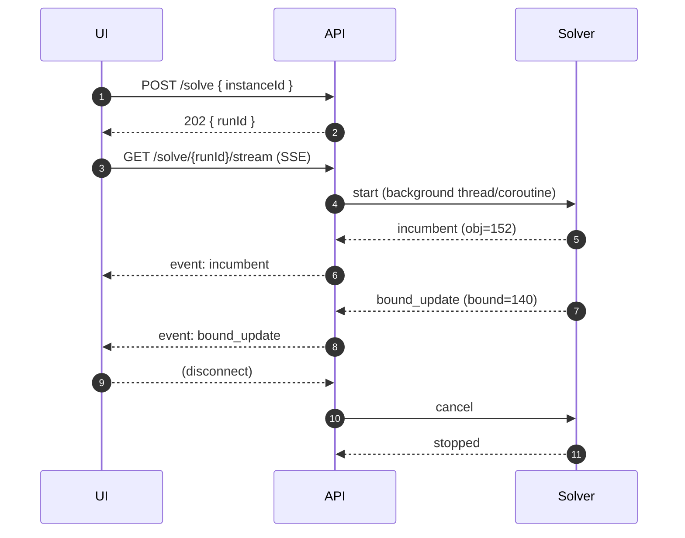

# Chapter 15 — Twin Backends: FastAPI + Ktor 3

> **Phase 7: End-to-end application** · Estimated: ~5h · Status: ready-to-start · Last updated: 2026-04-19

## Goal

Implement the locked OpenAPI contract (Chapter 14) in **both Python (FastAPI) and Kotlin (Ktor 3)**, bit-compatible on the wire. Solve runs in a background worker; clients receive streaming incumbent updates via Server-Sent Events; cancellation is honored; an integration test proves both backends produce equivalent-quality schedules for the same input.

## Before you start

- **Prerequisites:** Chapter 14 (spec locked at `spec-nsp-app-v1.0`); Chapters 11–13 (v1/v2/v3 solvers).
- **Required reading:**
  - `specs/nsp-app/` (the whole thing — it's your source of truth).
  - `apps/shared/openapi.yaml` — you implement this, unchanged.
  - FastAPI docs: <https://fastapi.tiangolo.com/> — particularly background tasks and streaming responses.
  - Ktor 3 docs: <https://ktor.io/docs/welcome.html> — particularly Flow-based streaming and coroutine cancellation.
- **Environment:**
  - Python: `uv` project at `apps/py-api/`; `fastapi[standard]`, `uvicorn`, `pydantic>=2.6`, `ortools`, `sse-starlette`.
  - Kotlin: Gradle project at `apps/kt-api/`; Ktor 3.x, `kotlinx.serialization`, `cpsat-kt` (composite build).

## Concepts introduced this chapter

- **OpenAPI-first implementation** — the spec doc is the contract; servers implement, clients consume.
- **Pydantic v2** (Python) / **`@Serializable` data classes** (Kotlin) — typed payloads.
- **Background executor** — `asyncio.to_thread` (Python; CP-SAT releases the GIL) / `Dispatchers.Default` (Kotlin).
- **Server-Sent Events (SSE)** — one-way streaming from server to client; simpler than WebSockets for this use case.
- **Solver cancellation** — `solver.stop_search()` (Python, from callback) / `Flow.cancel()` (Kotlin) triggered by client disconnect.
- **Request lifecycle** — client connects → queues solve → worker picks up → streams incumbents → final event → connection closes.
- **Integration test parity** — both backends solve the same instance, assert identical hard-constraint satisfaction and objective within a configured tolerance.
- **Generated client** — `openapi-typescript` produces TypeScript types from `openapi.yaml`; the web frontend consumes both APIs with the same type set.

## 1. Intuition

You have a spec; now you make it real — twice. The whole point of the twin backends is to exercise the discipline of the contract. If the Python server returns a schedule the Kotlin server wouldn't (or vice versa), the spec was ambiguous. Running both in CI on the same test cases is your automatic spec-auditor.

From a user's perspective, hitting `POST /solve` on either backend must be identical: same request shape, same response events, same semantics. The runtime details (thread pool vs coroutine dispatcher) are hidden. Even the error envelopes must match — that's why `09-acceptance-criteria.md` pinned specific error codes.

The streaming contract matters. The solver produces an incumbent every few seconds; the UI shows "best obj: 152 (bound: 140, gap: 8%)" live. Clients that disconnect must cancel the solve — otherwise your server grinds on dead work.

## 2. Formal definition

### 2.1 Endpoints (copied from `06-api-contract.md`)

| Method | Path | Contract summary |
|---|---|---|
| POST | `/instances` | Body = Instance JSON. Returns `{id}`. |
| GET | `/instances/{id}` | Returns the stored instance + summary. |
| POST | `/solve` | Body = `{instanceId, timeLimitSeconds, weights?, hintScheduleId?}`. Returns `{runId}`. |
| GET | `/solve/{runId}` | Poll: current `{status, bestObj, bestBound, gap, elapsed}`. |
| GET | `/solve/{runId}/stream` | SSE stream; event types: `incumbent`, `bound_update`, `status_change`, `final`. |
| DELETE | `/solve/{runId}` | Cancel. Returns 204. |
| POST | `/schedules/{id}/validate` | Re-validate a manually-edited schedule. |
| POST | `/schedules/{id}/export` | Download as CSV/PDF. |

### 2.2 SSE event envelope

```json
{
  "event": "incumbent",
  "data": {
    "runId": "...",
    "objective": 152,
    "bound": 140,
    "gap": 0.079,
    "elapsedSeconds": 7.3,
    "scheduleId": "..."
  }
}
```

For `final`:

```json
{
  "event": "final",
  "data": {
    "runId": "...",
    "status": "OPTIMAL",
    "objective": 138,
    "bound": 138,
    "elapsedSeconds": 24.1,
    "scheduleId": "..."
  }
}
```

### 2.3 Runtime shape



### 2.4 Cross-language mapping

| Concept | Python (FastAPI) | Kotlin (Ktor 3) |
|---|---|---|
| Route | `@app.post("/solve")` | `routing { post("/solve") { ... } }` |
| Body model | `class SolveRequest(BaseModel)` | `@Serializable data class SolveRequest(...)` |
| Background solve | `asyncio.to_thread(run_solver, ...)` | `CoroutineScope(Dispatchers.Default).launch { run_solver() }` |
| Cancellation | callback `return True` from `on_solution_callback` | `cancel()` on the coroutine / `Flow` collector |
| SSE response | `EventSourceResponse(generator())` (`sse-starlette`) | `call.respondTextWriter { ... }` or `channelFlow` + `respondTextWriter` |
| State storage (toy) | in-memory dict + `asyncio.Lock` | in-memory `ConcurrentHashMap` |
| DB (later) | SQLModel (SQLite) | Exposed (SQLite) |

## 3. Worked example by hand

Not applicable — you implement. But mentally rehearse this flow:

1. `POST /instances` with toy-01.json → 201, UUID.
2. `POST /solve` with `{instanceId, timeLimitSeconds: 10}` → 202, runId.
3. `GET /solve/{runId}/stream` → SSE: `incumbent obj=160 bound=140`, then `incumbent obj=152 bound=141`, ..., `final status=OPTIMAL obj=138`.
4. Verify: no background thread leaks after `final`. Verify: disconnect mid-stream triggers `cancelled` within 2s (per AC-5).

## 4. Python implementation

```
apps/py-api/
├── pyproject.toml
├── src/
│   └── nsp_api/
│       ├── __init__.py
│       ├── main.py            # FastAPI app
│       ├── models.py          # Pydantic v2 request/response
│       ├── storage.py         # in-memory store (swap later)
│       ├── solver_runner.py   # kicks off CP-SAT in a thread
│       └── sse.py             # SSE generator
└── tests/
    └── test_contract.py
```

```python
# apps/py-api/src/nsp_api/models.py
from typing import Literal
from pydantic import BaseModel, Field
from uuid import UUID


class SolveRequest(BaseModel):
    instance_id: UUID = Field(alias="instanceId")
    time_limit_seconds: float = Field(alias="timeLimitSeconds", ge=1, le=3600)
    weights: dict[str, int] | None = None
    hint_schedule_id: UUID | None = Field(default=None, alias="hintScheduleId")

    class Config:
        populate_by_name = True


class SolveResponse(BaseModel):
    run_id: UUID = Field(alias="runId")
    class Config: populate_by_name = True


class IncumbentEvent(BaseModel):
    event: Literal["incumbent"] = "incumbent"
    run_id: UUID
    objective: int
    bound: int | None
    gap: float | None
    elapsed_seconds: float


class FinalEvent(BaseModel):
    event: Literal["final"] = "final"
    run_id: UUID
    status: Literal["OPTIMAL", "FEASIBLE", "INFEASIBLE", "CANCELLED", "TIMEOUT"]
    objective: int | None
    bound: int | None
    elapsed_seconds: float
```

```python
# apps/py-api/src/nsp_api/solver_runner.py
import asyncio, threading, time, queue
from dataclasses import dataclass
from uuid import UUID, uuid4

from ortools.sat.python import cp_model

# reuse the chapter-11/12 models
from ch11_nsp_v1.src.model import build_model as build_hard
from ch12_nsp_v2.src.model_v2 import add_soft_objective, Weights


@dataclass
class RunHandle:
    run_id: UUID
    queue: asyncio.Queue    # events
    cancel_event: threading.Event
    started_at: float


class IncumbentCallback(cp_model.CpSolverSolutionCallback):
    def __init__(self, run_id, event_queue, cancel_event, loop):
        super().__init__()
        self._run_id = run_id
        self._q = event_queue
        self._cancel = cancel_event
        self._loop = loop
        self._start = time.monotonic()

    def on_solution_callback(self):
        if self._cancel.is_set():
            self.stop_search()
            return
        evt = {
            "event": "incumbent",
            "run_id": str(self._run_id),
            "objective": int(self.objective_value),
            "bound": int(self.best_objective_bound) if self.best_objective_bound is not None else None,
            "gap": ((self.objective_value - self.best_objective_bound) / max(abs(self.objective_value), 1)
                    if self.best_objective_bound is not None else None),
            "elapsed_seconds": time.monotonic() - self._start,
        }
        # thread → asyncio queue
        asyncio.run_coroutine_threadsafe(self._q.put(evt), self._loop)


def _solve_blocking(instance, weights, time_limit, handle: RunHandle, loop):
    model, x = build_hard(instance)
    add_soft_objective(model, x, instance, preferences={}, partners=[], weights=weights)
    solver = cp_model.CpSolver()
    solver.parameters.max_time_in_seconds = time_limit
    solver.parameters.num_search_workers = 8

    cb = IncumbentCallback(handle.run_id, handle.queue, handle.cancel_event, loop)
    status = solver.solve(model, cb)

    status_name = {
        cp_model.OPTIMAL: "OPTIMAL",
        cp_model.FEASIBLE: "FEASIBLE" if not handle.cancel_event.is_set() else "CANCELLED",
        cp_model.INFEASIBLE: "INFEASIBLE",
    }.get(status, "TIMEOUT")

    final = {
        "event": "final",
        "run_id": str(handle.run_id),
        "status": status_name,
        "objective": int(solver.objective_value) if status in (cp_model.OPTIMAL, cp_model.FEASIBLE) else None,
        "bound": int(solver.best_objective_bound) if status in (cp_model.OPTIMAL, cp_model.FEASIBLE) else None,
        "elapsed_seconds": solver.wall_time,
    }
    asyncio.run_coroutine_threadsafe(handle.queue.put(final), loop)
    asyncio.run_coroutine_threadsafe(handle.queue.put(None), loop)     # sentinel


async def start_run(instance, weights, time_limit) -> RunHandle:
    loop = asyncio.get_running_loop()
    handle = RunHandle(
        run_id=uuid4(),
        queue=asyncio.Queue(maxsize=1024),
        cancel_event=threading.Event(),
        started_at=time.monotonic(),
    )
    loop.run_in_executor(
        None,
        _solve_blocking, instance, weights, time_limit, handle, loop,
    )
    return handle
```

```python
# apps/py-api/src/nsp_api/main.py
import asyncio, json
from uuid import UUID
from fastapi import FastAPI, HTTPException, Request
from sse_starlette.sse import EventSourceResponse

from .models import SolveRequest, SolveResponse
from .storage import store
from .solver_runner import start_run

app = FastAPI(title="NSP App (Python)", version="1.0.0")
_runs: dict[UUID, "RunHandle"] = {}


@app.post("/instances", status_code=201)
async def post_instance(inst: dict):
    iid = store.put_instance(inst)
    return {"id": str(iid)}


@app.get("/instances/{id}")
async def get_instance(id: UUID):
    return store.get_instance(id) or HTTPException(404)


@app.post("/solve", response_model=SolveResponse, status_code=202)
async def post_solve(req: SolveRequest):
    instance = store.get_instance(req.instance_id)
    if instance is None:
        raise HTTPException(404, "Instance not found")
    handle = await start_run(instance, req.weights, req.time_limit_seconds)
    _runs[handle.run_id] = handle
    return {"runId": str(handle.run_id)}


@app.get("/solve/{run_id}/stream")
async def stream(run_id: UUID, request: Request):
    handle = _runs.get(run_id)
    if handle is None:
        raise HTTPException(404)

    async def event_gen():
        try:
            while True:
                if await request.is_disconnected():
                    handle.cancel_event.set()
                    break
                try:
                    evt = await asyncio.wait_for(handle.queue.get(), timeout=1.0)
                except asyncio.TimeoutError:
                    yield {"event": "heartbeat", "data": "{}"}
                    continue
                if evt is None:
                    break
                yield {"event": evt["event"], "data": json.dumps(evt)}
        except asyncio.CancelledError:
            handle.cancel_event.set()
            raise

    return EventSourceResponse(event_gen())


@app.delete("/solve/{run_id}", status_code=204)
async def cancel(run_id: UUID):
    handle = _runs.get(run_id)
    if handle is None:
        raise HTTPException(404)
    handle.cancel_event.set()
    return None
```

## 5. Kotlin implementation (via `cpsat-kt`)

```
apps/kt-api/
├── build.gradle.kts
├── settings.gradle.kts    # includeBuild("../../libs/cpsat-kt")
└── src/main/kotlin/io/vanja/nspapi/
    ├── Main.kt
    ├── Models.kt
    ├── Storage.kt
    └── SolverRunner.kt
```

```kotlin
// apps/kt-api/src/main/kotlin/io/vanja/nspapi/Models.kt
package io.vanja.nspapi

import kotlinx.serialization.Serializable
import kotlinx.serialization.SerialName

@Serializable
data class SolveRequest(
    val instanceId: String,
    val timeLimitSeconds: Double,
    val weights: Map<String, Int>? = null,
    val hintScheduleId: String? = null,
)

@Serializable
data class SolveResponse(val runId: String)

@Serializable
sealed interface StreamEvent {
    val runId: String

    @Serializable @SerialName("incumbent")
    data class Incumbent(
        override val runId: String,
        val objective: Long,
        val bound: Long?,
        val gap: Double?,
        val elapsedSeconds: Double,
    ) : StreamEvent

    @Serializable @SerialName("final")
    data class Final(
        override val runId: String,
        val status: String,
        val objective: Long?,
        val bound: Long?,
        val elapsedSeconds: Double,
    ) : StreamEvent
}
```

```kotlin
// apps/kt-api/src/main/kotlin/io/vanja/nspapi/SolverRunner.kt
package io.vanja.nspapi

import io.vanja.cpsat.*
import ch11.buildModel
import ch11.InstanceDef
import ch12.addSoftObjective
import ch12.Weights
import kotlinx.coroutines.*
import kotlinx.coroutines.channels.Channel
import kotlinx.coroutines.flow.*
import java.util.UUID
import kotlin.time.TimeSource

class Run(
    val id: UUID,
    val flow: SharedFlow<StreamEvent>,
    val job: Job,
)

class SolverRunner(private val scope: CoroutineScope) {
    private val runs = java.util.concurrent.ConcurrentHashMap<UUID, Run>()

    fun start(instance: InstanceDef, req: SolveRequest): Run {
        val id = UUID.randomUUID()
        val events = MutableSharedFlow<StreamEvent>(replay = 32, extraBufferCapacity = 256)
        val startMark = TimeSource.Monotonic.markNow()

        val job = scope.launch(Dispatchers.Default) {
            val (model, vars) = buildModel(instance)
            model.addSoftObjective(vars, emptyMap(), emptyList(), Weights())

            model.solveFlow {
                maxTimeInSeconds = req.timeLimitSeconds
                numSearchWorkers = 8
                logSearchProgress = false
            }.collect { sol ->
                events.emit(StreamEvent.Incumbent(
                    runId = id.toString(),
                    objective = sol.objective,
                    bound = sol.bound,
                    gap = sol.gap,
                    elapsedSeconds = startMark.elapsedNow().inWholeMilliseconds / 1000.0,
                ))
            }

            events.emit(StreamEvent.Final(
                runId = id.toString(),
                status = "OPTIMAL",   // TODO: pull status from solveFlow terminator
                objective = null, bound = null,
                elapsedSeconds = startMark.elapsedNow().inWholeMilliseconds / 1000.0,
            ))
        }

        val run = Run(id, events.asSharedFlow(), job)
        runs[id] = run
        return run
    }

    fun get(id: UUID): Run? = runs[id]
    fun cancel(id: UUID) { runs[id]?.job?.cancel() }
}
```

```kotlin
// apps/kt-api/src/main/kotlin/io/vanja/nspapi/Main.kt
package io.vanja.nspapi

import io.ktor.http.*
import io.ktor.serialization.kotlinx.json.*
import io.ktor.server.application.*
import io.ktor.server.engine.*
import io.ktor.server.netty.*
import io.ktor.server.plugins.contentnegotiation.*
import io.ktor.server.request.*
import io.ktor.server.response.*
import io.ktor.server.routing.*
import io.ktor.sse.*
import io.ktor.server.sse.*
import kotlinx.coroutines.CoroutineScope
import kotlinx.coroutines.SupervisorJob
import kotlinx.coroutines.flow.*
import kotlinx.serialization.encodeToString
import kotlinx.serialization.json.Json
import java.util.UUID

fun main() {
    val scope = CoroutineScope(SupervisorJob())
    val runner = SolverRunner(scope)
    val store = InMemoryStore()

    embeddedServer(Netty, port = 8080) {
        install(ContentNegotiation) { json() }
        install(SSE)
        routing {
            post("/instances") {
                val body = call.receive<ch11.InstanceDef>()
                val id = store.putInstance(body)
                call.respond(HttpStatusCode.Created, mapOf("id" to id.toString()))
            }
            post("/solve") {
                val req = call.receive<SolveRequest>()
                val inst = store.getInstance(UUID.fromString(req.instanceId))
                    ?: return@post call.respond(HttpStatusCode.NotFound)
                val run = runner.start(inst, req)
                call.respond(HttpStatusCode.Accepted, SolveResponse(run.id.toString()))
            }
            sse("/solve/{runId}/stream") {
                val id = UUID.fromString(call.parameters["runId"]!!)
                val run = runner.get(id) ?: run {
                    call.respond(HttpStatusCode.NotFound); return@sse
                }
                run.flow.onCompletion { runner.cancel(id) }
                    .collect { evt ->
                        send(ServerSentEvent(
                            event = when (evt) {
                                is StreamEvent.Incumbent -> "incumbent"
                                is StreamEvent.Final -> "final"
                            },
                            data = Json.encodeToString(evt),
                        ))
                    }
            }
            delete("/solve/{runId}") {
                val id = UUID.fromString(call.parameters["runId"]!!)
                runner.cancel(id)
                call.respond(HttpStatusCode.NoContent)
            }
        }
    }.start(wait = true)
}
```

### Parity integration test

```python
# apps/shared/integration_tests/test_parity.py
"""Fire the same instance at both backends; assert equivalent schedules."""
import httpx, time, json, pathlib

TOY = json.loads(pathlib.Path("data/nsp/toy-01.json").read_text())


def drive(url: str, instance: dict) -> dict:
    c = httpx.Client(base_url=url, timeout=60)
    iid = c.post("/instances", json=instance).json()["id"]
    rid = c.post("/solve", json={
        "instanceId": iid, "timeLimitSeconds": 30
    }).json()["runId"]

    incumbents = []
    final = None
    with c.stream("GET", f"/solve/{rid}/stream") as resp:
        for line in resp.iter_lines():
            if not line or not line.startswith("data:"):
                continue
            evt = json.loads(line.removeprefix("data:").strip())
            if evt.get("event") == "final":
                final = evt; break
            if evt.get("event") == "incumbent":
                incumbents.append(evt)
    return {"incumbents": incumbents, "final": final}


def test_parity():
    py = drive("http://localhost:8000", TOY)
    kt = drive("http://localhost:8080", TOY)
    assert py["final"]["status"] == kt["final"]["status"]
    # Hard-feasibility: both produce valid schedules
    # Objectives may differ by ≤ configured tolerance if both hit time-limit
    if py["final"]["status"] == "OPTIMAL" == kt["final"]["status"]:
        assert py["final"]["objective"] == kt["final"]["objective"]
```

Run in CI: launch both backends, seed the store, run the test.

## 6. MiniZinc implementation

Not applicable — the backends wrap CP-SAT directly.

## 7. Comparison & takeaways

| Axis | FastAPI (Python) | Ktor 3 (Kotlin) |
|---|---|---|
| Routing DSL | Decorators (`@app.get`) | Lambdas in `routing { }` |
| Request deserialization | Pydantic v2 (rich validation) | kotlinx.serialization (fast, less validation out-of-box) |
| Background solve | `run_in_executor` (thread pool) | `Dispatchers.Default.launch` (coroutine) |
| Cancellation propagation | `threading.Event` checked in callback | Natural — `job.cancel()` cancels the Flow collector |
| SSE | `sse-starlette` (third-party but mature) | Built-in Ktor SSE plugin |
| OpenAPI generation | FastAPI auto-generates (at `/openapi.json`) | Manual, via `ktor-openapi` plugin or maintaining `openapi.yaml` as source of truth |
| Hot reload | `uvicorn --reload` | `./gradlew run -t` (Gradle continuous) |
| Typical LOC for the service | ~250 | ~350 |

**Key insight:** The two backends are **behavior-identical on the wire**. Their internal idioms (thread pool vs coroutines) are invisible to the client. This is the payoff of the spec-driven approach: runtime choice is a tactical decision inside each server, not a contract choice.

## 8. Exercises

**Exercise 15-A: Top-k solutions.** Add an endpoint `POST /solve/topk` that returns the `k` best distinct feasible schedules (not just the optimum). Use `model.add` to forbid each returned solution, then re-solve. Stream them as one SSE per solution.

<details><summary>Hint</summary>
After finding a solution, add the constraint `sum((x[n,d,s] for each on-cell)) <= total_on_cells - 1` to exclude it, then re-solve. Stop at `k` or when `INFEASIBLE`.
</details>

**Exercise 15-B: API-key auth.** Add `Authorization: Bearer <key>` middleware on both stacks. Reject missing/invalid keys with 401. Keys hard-coded in env var for v1; move to a DB later.

<details><summary>Hint</summary>
Python: `Depends(require_api_key)` dependency. Kotlin: `intercept(ApplicationCallPipeline.Plugins) { ... }` or `install(Authentication) { bearer { ... } }`.
</details>

**Exercise 15-C: Rate limiting.** Cap each API key to 10 solve runs per minute. Return 429 with `Retry-After` header on overage.

<details><summary>Hint</summary>
Python: `slowapi` middleware. Kotlin: `install(RateLimit) { register { rateLimiter(limit = 10, refillPeriod = 60.seconds) } }`.
</details>

**Exercise 15-D: Parity diff report.** Extend the integration test to solve 5 instances on both backends and emit a markdown report: per instance, did they both return `OPTIMAL`? Same objective? Same wall time within ±20%? Commit the report generator.

<details><summary>Hint</summary>
Reuse the `drive()` helper. Use `pytest-html` or write the markdown directly.
</details>

**Exercise 15-E: Generate the TypeScript client.** Run `openapi-typescript apps/shared/openapi.yaml -o apps/web/src/api/types.ts`. Write a tiny `apiClient.ts` that wraps both backends behind the same typed interface; a `backend` prop chooses which one. Ship this as the foundation for Chapter 16.

<details><summary>Hint</summary>
```typescript
// apps/web/src/api/apiClient.ts
import type { paths } from "./types";
export function makeClient(baseUrl: string) {
  return {
    postInstance: (body: paths["/instances"]["post"]["requestBody"]["content"]["application/json"]) =>
      fetch(`${baseUrl}/instances`, { method: "POST", body: JSON.stringify(body) })
        .then(r => r.json()),
    // ... and so on for each endpoint
  };
}
```
</details>

## 9. Self-check

<details><summary>Q1: How do you cancel a running solve cleanly in each runtime?</summary>
Python: a `threading.Event` set by the HTTP layer; the `CpSolverSolutionCallback.on_solution_callback` checks it and calls `self.stop_search()`. Kotlin: `job.cancel()` on the coroutine running `model.solveFlow(...)` — the Flow cooperates with coroutine cancellation naturally, and `cpsat-kt` bridges to `solver.stopSearch()`.
</details>

<details><summary>Q2: Right status code for "still thinking, partial solution available"?</summary>
202 Accepted for the initial `POST /solve` (we've started, not done). The SSE stream carries the partial solutions; the final event carries a terminal status ("OPTIMAL", "FEASIBLE", "CANCELLED", "TIMEOUT"). Don't use a non-standard 2xx code for partial — use events.
</details>

<details><summary>Q3: Why SSE and not WebSockets?</summary>
SSE is one-way (server → client), which is all we need for solve streaming. Simpler to proxy, plays nice with HTTP/2, gracefully reconnects. WebSockets are for bidirectional chat-like flows — overkill here.
</details>

<details><summary>Q4: What happens if the client loses connection mid-solve?</summary>
The server detects the disconnect (FastAPI: `request.is_disconnected()`; Ktor: Flow cancellation due to writer closure). It sets the cancel event / cancels the coroutine; the solver checks the flag at its next callback and stops. The run's state transitions to `cancelled` in the store. Any future `GET /solve/{runId}` reports `cancelled`.
</details>

<details><summary>Q5: Why should both backends share the same OpenAPI document rather than each generating its own?</summary>
One source of truth. If both regenerate, they can drift. A hand-maintained `openapi.yaml` forces you to update the contract deliberately. FastAPI can generate its own from code for development, but the authoritative doc is the file in `apps/shared/`.
</details>

## 10. What this unlocks

With two backends live on the same contract, you can build **one UI** that works against either, in **Chapter 16** — Vite + React 19 + React Router v7.

## 11. Further reading

- FastAPI docs: <https://fastapi.tiangolo.com/> — especially [background tasks](https://fastapi.tiangolo.com/tutorial/background-tasks/) and [streaming responses](https://fastapi.tiangolo.com/advanced/custom-response/#streamingresponse).
- `sse-starlette` for SSE: <https://github.com/sysid/sse-starlette>
- Ktor 3 docs: <https://ktor.io/docs/welcome.html>, [SSE plugin](https://ktor.io/docs/server-server-sent-events.html), [Coroutines](https://kotlinlang.org/docs/coroutines-guide.html).
- Pydantic v2 migration guide: <https://docs.pydantic.dev/latest/migration/>.
- `kotlinx.serialization` tutorial: <https://github.com/Kotlin/kotlinx.serialization/blob/master/docs/serialization-guide.md>.
- MDN on Server-Sent Events: <https://developer.mozilla.org/en-US/docs/Web/API/Server-sent_events>.
- `openapi-typescript`: <https://github.com/openapi-ts/openapi-typescript>.
